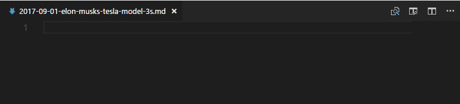
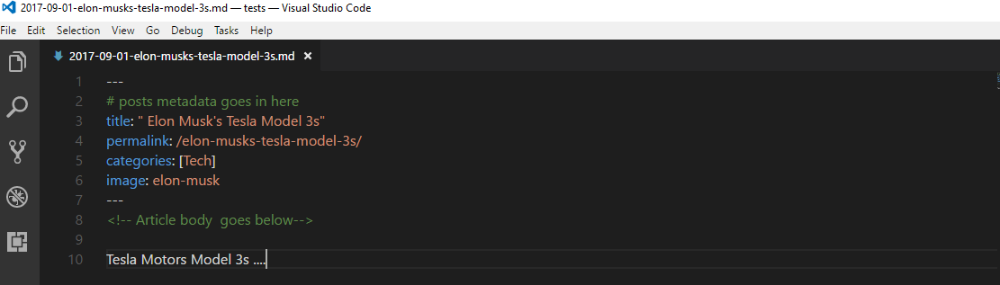

# Writing New Stories
To write new stories/articles you create a new file in the **_posts** directory. The file for a story follows the following naming convention.

YEAR-MONTH-DATE-POST_TITLE.md

For example if you want to write a new story about Elon Musk's Tesla Model 3s  you would  follow these steps

* Create a new file in the **_posts** directory named
 <!-- > 2017-09-01-elon-musks-tesla-model-3s.md 

 -->
* At the top of file write a pair of 3 dashes.This is where you write the articles front matter goes
<!-- > ---

   --- -->
* In between the dashes, set the article's metadata (permalink, categories, image, title). The image name is optional. 
<!-- > ---

   title: " Elon Musk's Tesla Model 3s"
   permalink: /elon-musks-tesla-model-3s/
   categories: [Tech]
   image: elon-musk
   --- -->
* If you do not specify the image, the article will try to look for a file named as the permalink

